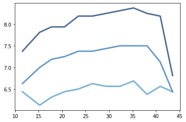

[Think Stats Chapter 7 Exercise 1](http://greenteapress.com/thinkstats2/html/thinkstats2008.html#toc70) (weight vs. age)

import numpy as np
import sys
import nsfg
import thinkstats2
import thinkplot
import first
import pandas as pd
np.set_printoptions(threshold=sys.maxsize)
pd.set_option('display.max_columns', None)
pd.set_option('display.max_rows', None)
live, firsts, others = first.MakeFrames()
#live.dtypes
df = live.dropna(subset=['agepreg', 'totalwgt_lb'])
bins = np.arange(10, 48, 3)
indices = np.digitize(df.agepreg,bins)
groups = df.groupby(indices) ##here the groupby behaves like an object
#df.agepreg.head()
#df.agepreg
for i, group in groups:
    print(i,len(group))
age_plot = [group.agepreg.mean() for i, group in groups]
weight_cdf = [thinkstats2.Cdf(group.totalwgt_lb) for i, group in groups]
for percent in [75,50,25]:
    weights = [cdf.Percentile(percent) for cdf in weight_cdf]
    label = '%dth'%percent 
    thinkplot.Plot(age_plot,weights,label=label)
    #Computing the Pearson's correlation
p_corr = thinkstats2.Corr(df.agepreg, df.totalwgt_lb)
p_corr

s_corr = thinkstats2.SpearmanCorr(df.agepreg,df.totalwgt_lb)
s_corr
